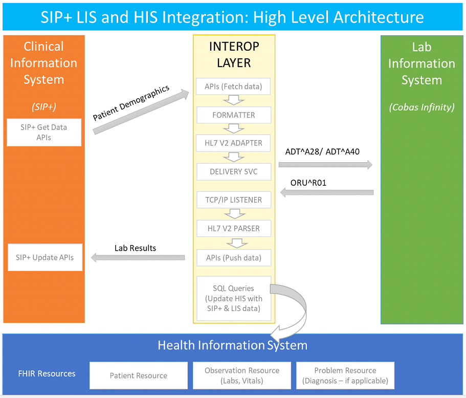
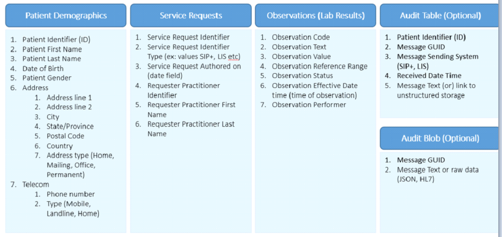

# MedLab-Engine

In order to develop the IT Surveillance Systems for Hyperglycemia in Pregnancy (HiP), 
the solution proposed by DERPi requires build out of a new Health Information System (HIS)
which would act as a central repository of clinical information across RHAs.
 As such, the solution should address the interoperability requirement for exchanging patient demographics and lab results between SIP+ and Cobas Infinity 

## Project Architecture

## DataBase Design

- Following Models are created here:

    - Patient Demographics
    - Audit Table
    - Service Request
    - Lab Result
    - Audit Blob

## Controller :

### PatientController(API Controller)

 - GetPatientDemographics - Fetch data from SipPlus and save changes to patient table.
 - GetServiceRequest - Fetch data from API and save changes to Service Request table
 - GetLabResults - Fetch data from Api and save changes to Observations table
 - GetAuditTable - Tempeorary stored data and save changes to Audit Table table
 - GetAuditblob - Tempeorary stored data and save changes to Audit blob table

